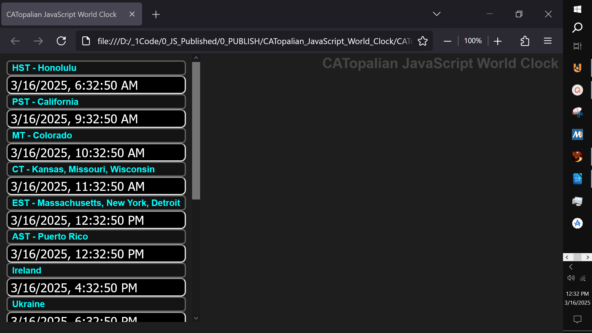

# CATopalian JavaScript World Clock
A JavaScript World Clock that shows the time from across the world.

VIDEO: https://youtu.be/NGan3hT_0-g

---

### How to Download this App
1. Click the green Code Button on this github page
2. Choose Download ZIP
3. Save the Zip File
4. Extract All
5. Double click the HTML file to start the App

---

Hapy Scripting :-)